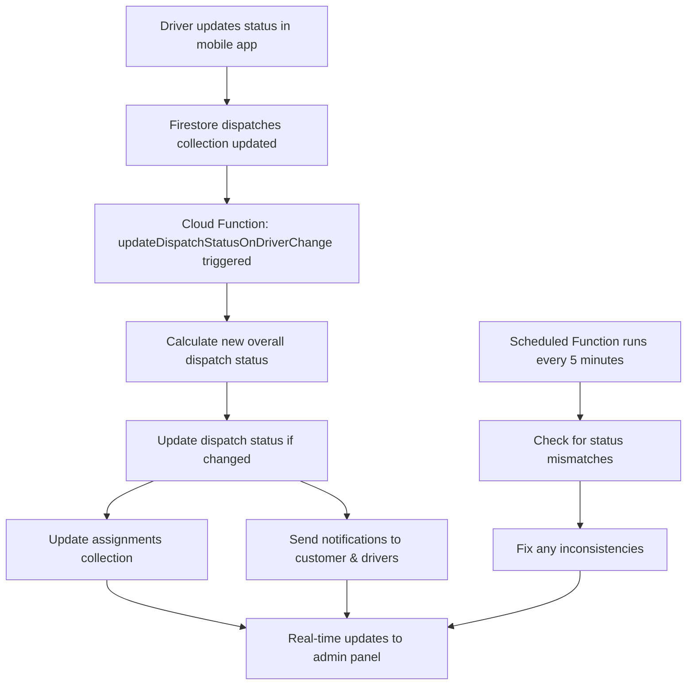

# Firebase Cloud Functions Integration Guide

## 🎯 Overview
These Cloud Functions ensure real-time status updates work even when the admin panel is offline.

## 🚀 Deployed Functions

### 1. `updateDispatchStatusOnDriverChange`
**Type**: Firestore Trigger  
**Trigger**: When any document in `dispatches` collection is updated  
**Purpose**: Automatically calculates and updates dispatch status when driver assignments change

### 2. `updateDriverStatus` 
**Type**: HTTP Callable Function  
**Purpose**: Allows mobile app to update driver status with immediate processing  

### 3. `scheduledStatusSync`
**Type**: Scheduled Function (runs every 5 minutes)  
**Purpose**: Ensures consistency by fixing any missed status updates

---

## 📱 Mobile App Integration

### Option 1: Direct Firestore Update (Current Method)
Mobile app continues to update Firestore directly. The trigger function will handle the rest automatically.

```javascript
// Mobile app continues using current method
await updateDoc(doc(db, 'dispatches', dispatchId), {
  [`driverAssignments.${driverId}.status`]: 'in-progress',
  [`driverAssignments.${driverId}.startedAt`]: new Date(),
  updatedAt: new Date()
});
// ✅ Cloud Function will automatically trigger and sync status
```

### Option 2: Call Cloud Function Directly (Recommended)
For better error handling and immediate feedback:

```javascript
// Mobile app can call the Cloud Function directly
import { getFunctions, httpsCallable } from 'firebase/functions';

const functions = getFunctions();
const updateDriverStatus = httpsCallable(functions, 'updateDriverStatus');

try {
  const result = await updateDriverStatus({
    dispatchId: 'dispatch_id_here',
    driverId: 'driver_id_here',
    newStatus: 'in-progress'
  });
  
  console.log('✅ Status updated:', result.data);
} catch (error) {
  console.error('❌ Failed to update status:', error);
}
```

---

## 🔄 How It Works



---

## 📊 Status Calculation Logic

```javascript
// Automatic status calculation:
if (all drivers completed) {
    dispatch.status = 'completed'
} else if (any driver in-progress) {
    dispatch.status = 'in-progress'  
} else if (all drivers assigned) {
    dispatch.status = 'assigned'
}
```

---

## 🔔 Notifications Sent

### Customer Notifications
- **In Progress**: "Your dispatch #DSP-88452 is now in progress..."
- **Completed**: "Your dispatch #DSP-88452 has been completed..."

### Driver Notifications  
- **Completion**: Sent to all drivers when dispatch is completed

### Admin Notifications
- **Status Changes**: Global notifications for all status updates

---

## 🛡️ Benefits

✅ **Works offline**: Status updates happen even when admin panel is closed  
✅ **Real-time sync**: Immediate status calculation and notification  
✅ **Consistent data**: Assignments collection stays synchronized  
✅ **Reliable**: Scheduled backup sync every 5 minutes  
✅ **Scalable**: Handles multiple concurrent updates  

---

## 🚀 Deployment Instructions

### Prerequisites
```bash
# Install Firebase CLI
npm install -g firebase-tools

# Login to Firebase  
firebase login
```

### Deploy Functions
```bash
# Run the deployment script
./deploy-functions.bat   # Windows
./deploy-functions.sh    # Linux/Mac

# Or deploy manually:
cd functions
npm install
cd ..
firebase deploy --only functions
```

### Verify Deployment
1. Check Firebase Console > Functions section
2. Monitor logs: `firebase functions:log`
3. Test with mobile app status updates

---

## 🔍 Monitoring & Debugging

### View Function Logs
```bash
# View all function logs
firebase functions:log

# View specific function logs
firebase functions:log --only updateDispatchStatusOnDriverChange
```

### Common Log Messages
- `🔄 Dispatch updated, checking for driver assignment changes...`
- `✅ Successfully updated dispatch to in-progress`
- `📧 Customer notification sent`
- `🕒 Running scheduled status sync...`

---

## ⚠️ Important Notes

1. **Function Region**: Functions deploy to `us-central1` by default
2. **Cold Starts**: First execution may be slower (~2-3 seconds)
3. **Costs**: Pay-per-invocation model (very cost-effective for typical usage)
4. **Security**: Functions run with admin privileges (secure by default)
5. **Retries**: Failed functions automatically retry with exponential backoff

---

## 🎉 Result

Once deployed, your system will have **100% uptime** for status synchronization, regardless of admin panel availability!
